# Himalaya Traders — Phase-wise Architecture

**Pair with:** [DEVELOPMENT_PLAN.md](./DEVELOPMENT_PLAN.md)  
**Stack:** React SPA ↔ Express REST (`/api/v1`) ↔ Prisma ↔ MySQL  
**Pattern:** 3-tier, feature modules, JWT + RBAC, transactional billing

Use this file to **see** what exists after each phase. Grey / missing boxes in a phase diagram are **not built yet**.

---

## How to read

| Symbol | Meaning |
|---|---|
| Solid box | Lives after that phase |
| Dashed box | Planned, not built yet |
| `FE` | React page / client |
| `BE` | Express module |
| `DB` | MySQL table |

---

## 0. Target architecture (end of Phase 13)

This is the **finished** system. Phases 0–12 grow toward this picture.

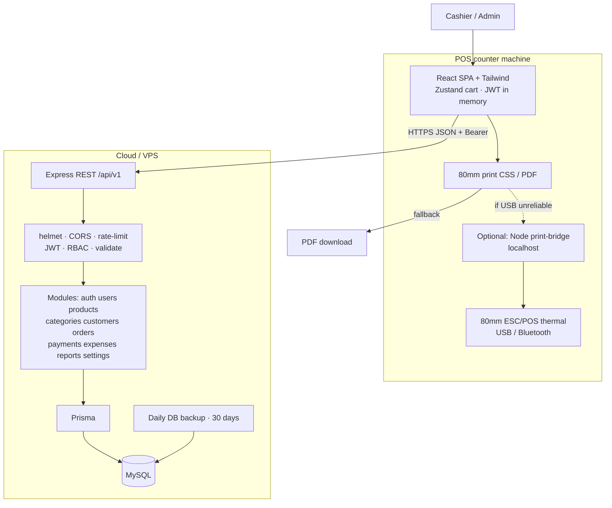

### Request path (every authenticated call)

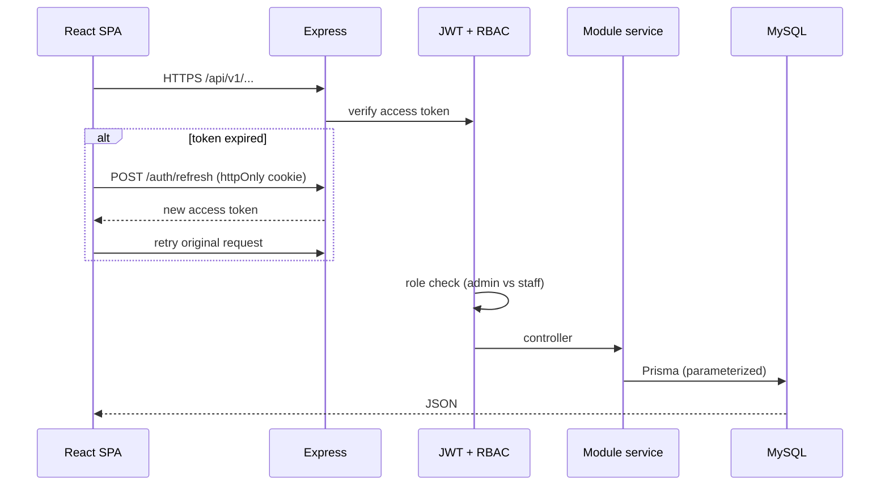

### Physical / deploy view

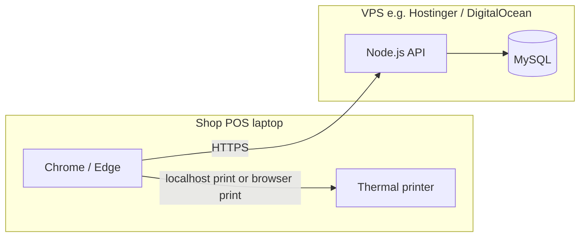

---

## 1. Final folder architecture

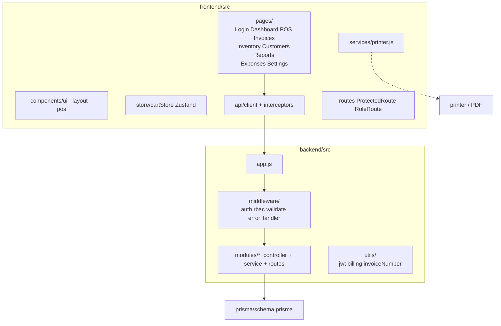

---

## 2. Data model (complete ER)

Built table-by-table across phases. This is the **final** schema.

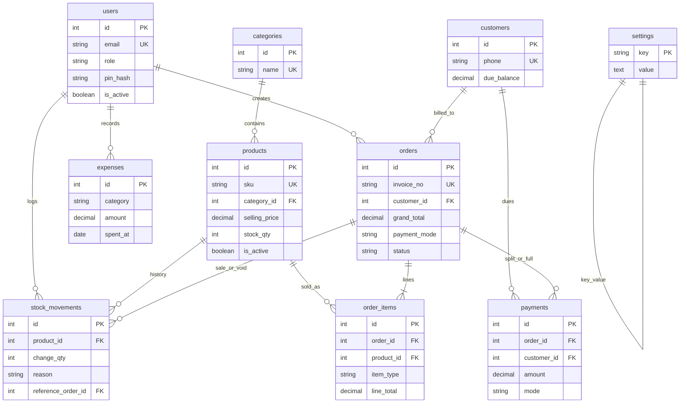

---

## 3. Module dependency graph (build order)

Arrows = “must exist first”.

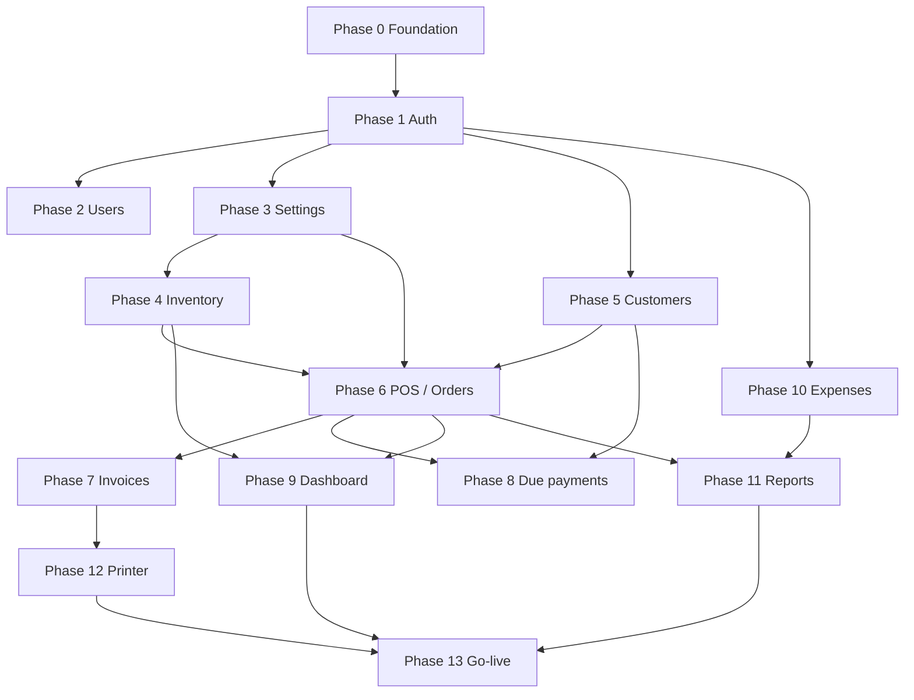

---

## 4. Phase-wise architecture (what you can see after each phase)

Each diagram is **cumulative**: earlier boxes stay; new boxes are marked `NEW`.

---

### PHASE 0 — Foundation

Empty runnable skeleton. No login, no business data.

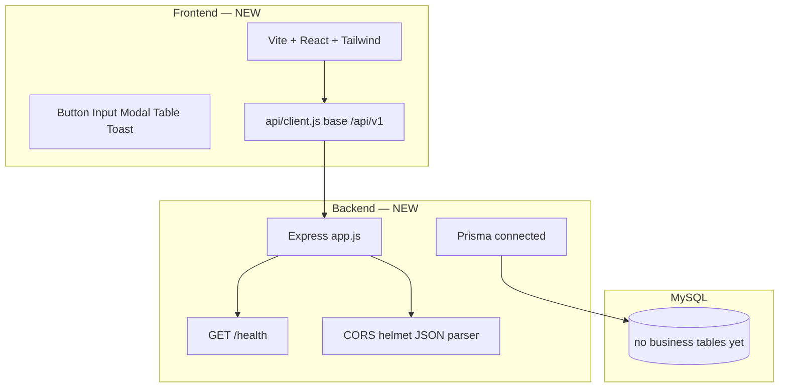

| Layer | Exists | Does not exist |
|---|---|---|
| FE | App shell, UI kit, API client stub | Pages, cart, routes |
| BE | Health, env, error handler | Auth, modules |
| DB | Connection only | All tables |

---

### PHASE 1 — Authentication

First real feature. JWT session. Role guards (empty pages still 404 except Login).

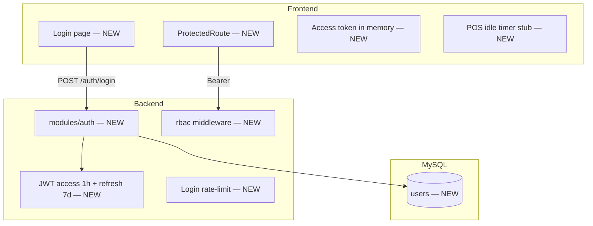

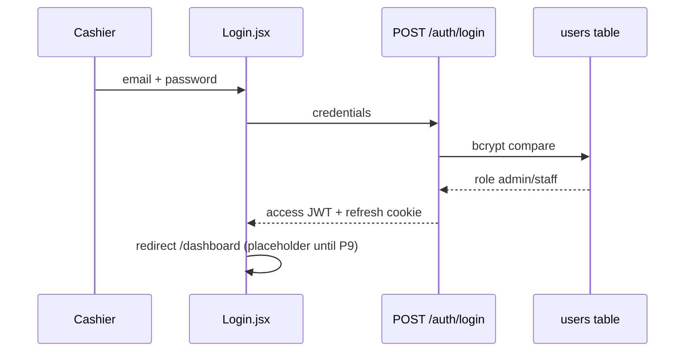

| New APIs | New tables | New screens |
|---|---|---|
| `POST /auth/login` `refresh` `logout` `verify-pin` | `users` | Login |

---

### PHASE 2 — Users & Admin PIN

Staff accounts live inside Settings (Users tab). PIN hash on `users`.

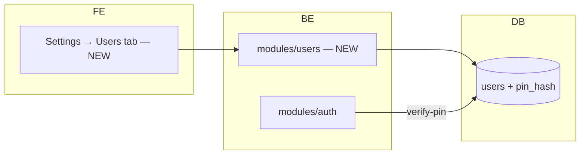

| New APIs | Screens |
|---|---|
| `GET/POST /users` `PUT /users/:id` PIN + password reset | Settings Users |

---

### PHASE 3 — Settings (config store)

Billing **must not hardcode** GST / rates. Key-value `settings` table.

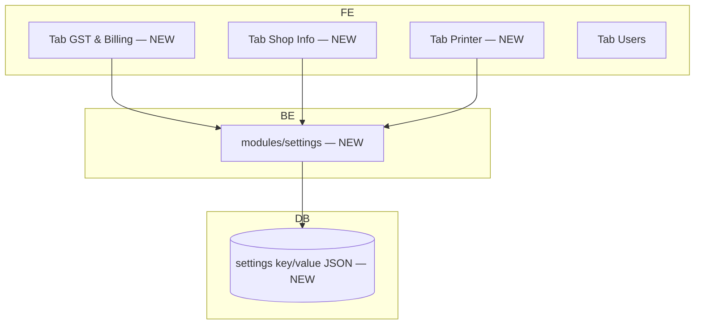

POS later **reads** these keys: `gst_percent`, `gst_split`, `staff_discount_cap_percent`, flex/card rates, invoice prefix, auto-print.

---

### PHASE 4 — Inventory

Product master + stock ledger. Staff = view only (RBAC on BE + hidden buttons on FE).

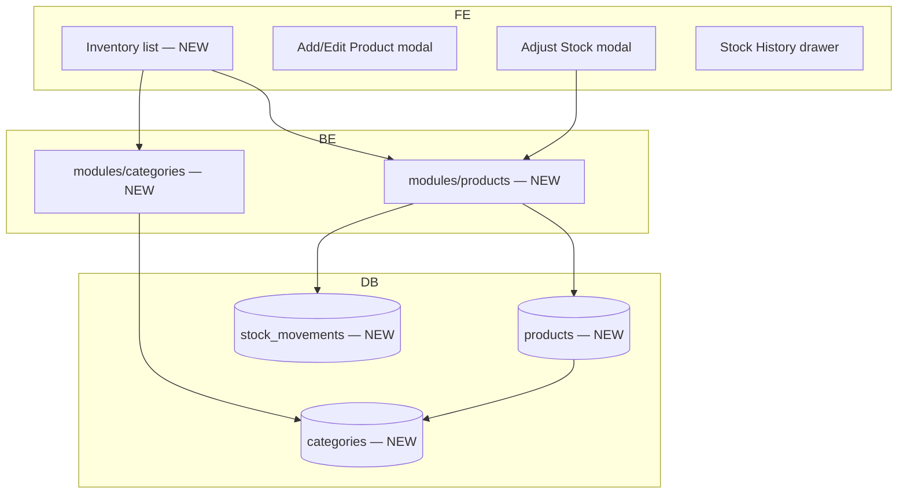

**Stock write rules (from this phase on):** never change `products.stock_qty` without a `stock_movements` row.

| Reason enum | Who writes it | Phase |
|---|---|---|
| `purchase` / `damage` / `adjustment` | Admin adjust modal | 4 |
| `sale` | POS generate invoice | 6 |
| `void` | Admin void invoice | 7 |

---

### PHASE 5 — Customers

Master data for POS auto-fill (phone). Dues column exists; **payments in Phase 8**.

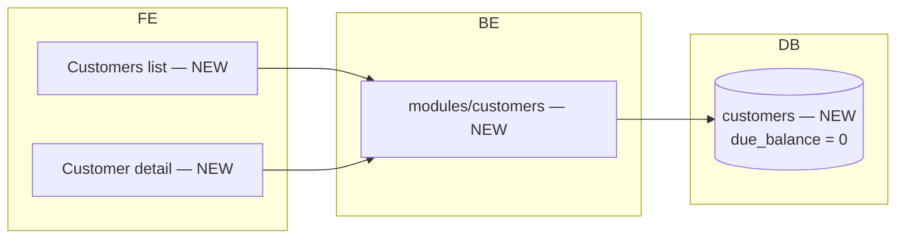

POS (next phase) will `GET /customers?search=` on phone debounce.

---

### PHASE 6 — POS / Billing  ★ critical path

First money flow. **One DB transaction:** order + items + stock + payment + due.

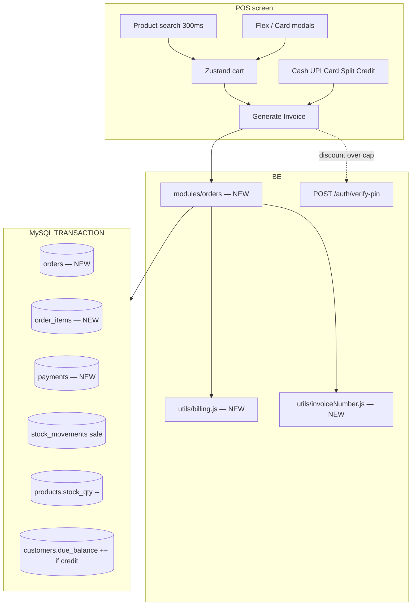

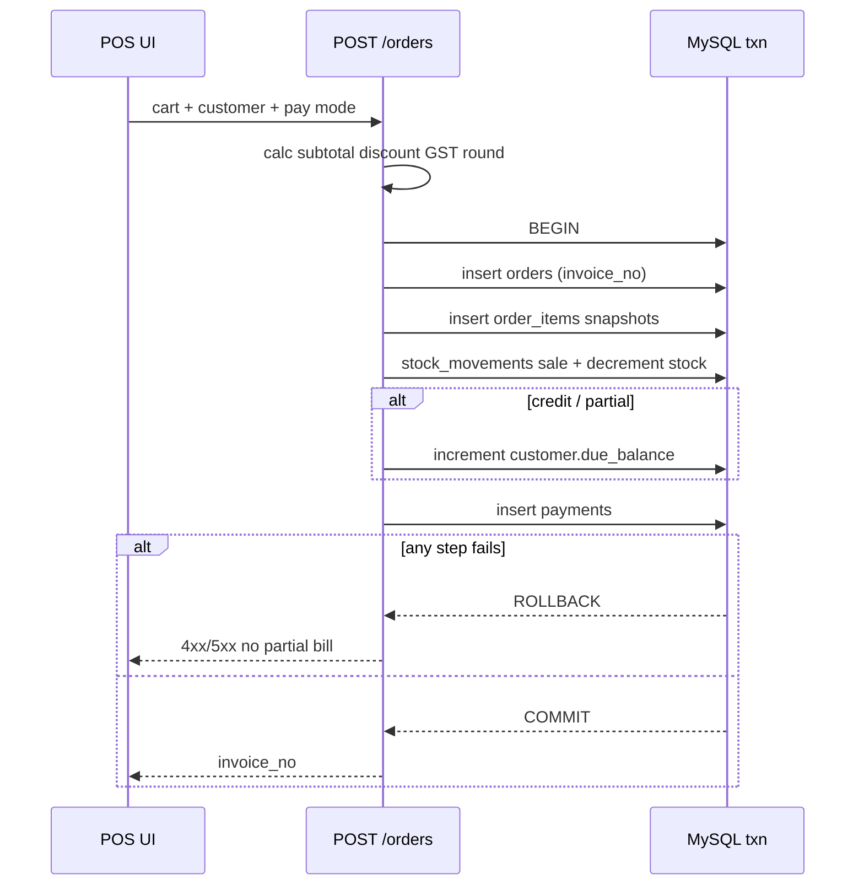

**Line types inside `order_items`**

| `item_type` | `product_id` | Stock |
|---|---|---|
| `product` | set | Deduct |
| `flex_print` | null | No |
| `card_print` | null | No |

---

### PHASE 7 — Invoice management

Read model + admin void (reverse of Phase 6 txn).

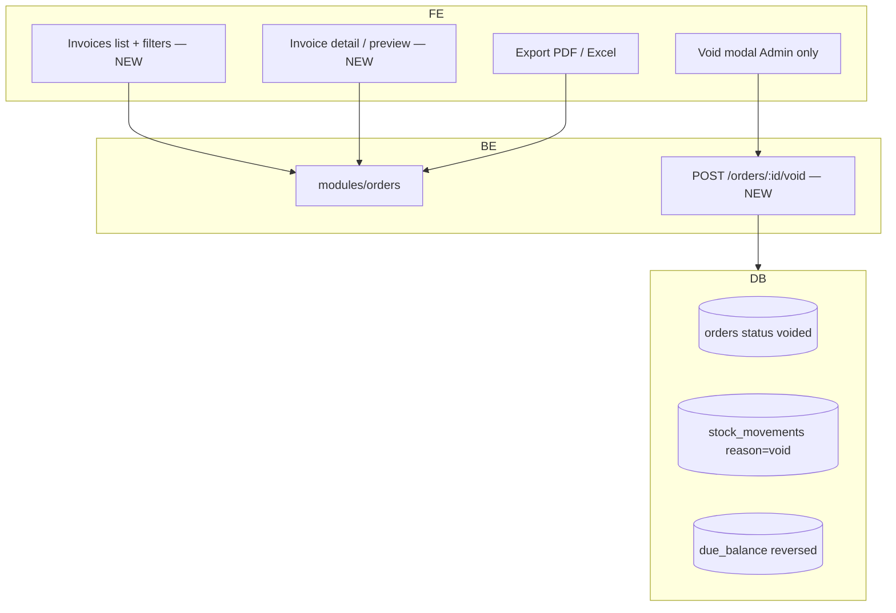

Reprint **does not** re-price. It prints `order_items` snapshot.

---

### PHASE 8 — Due payments

Standalone payment (no new invoice).

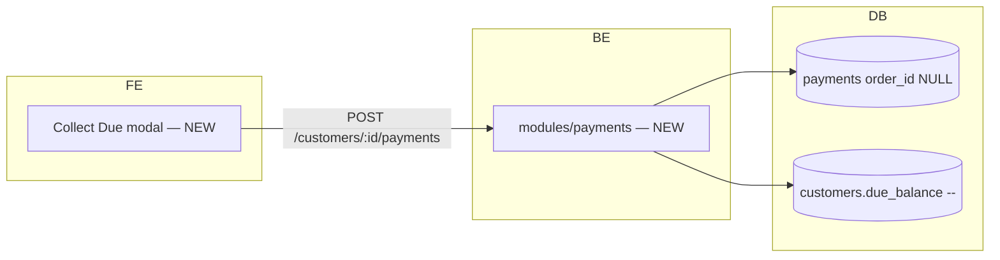

---

### PHASE 9 — Dashboard

Landing page. Poll every **60s**.

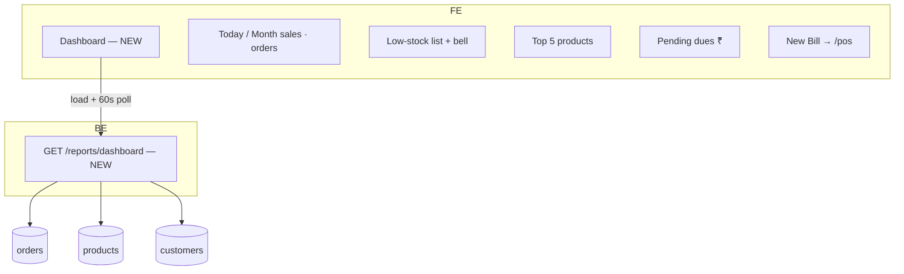

---

### PHASE 10 — Expenses

Admin-only. Feeds P&L in Phase 11.

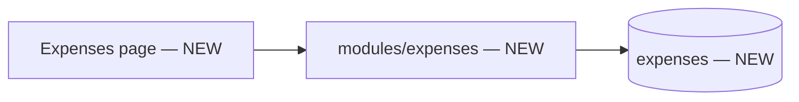

Staff: route hidden + API 403.

---

### PHASE 11 — Reports & Analytics

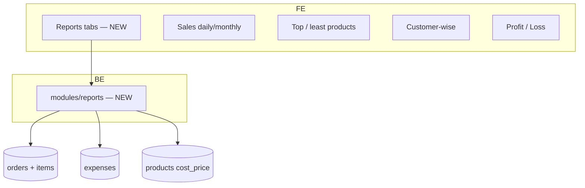

**P&L formula:** `sales − expenses − COGS`  
**COGS:** `sum(cost_price × qty sold)` — store cost on the line at sale time (Phase 6 snapshot).

Staff: **Sales tab, today only**. Other tabs hidden; APIs 403.

---

### PHASE 12 — Thermal print

Print is a **client-side** concern. API only stores the invoice snapshot.

```mermaid
flowchart TB
  subgraph POS_PC["POS machine"]
    UI["Invoice detail / POS success"]
    Svc["services/printer.js — NEW"]
    CSS["80mm @page CSS"]
    PDF["PDF fallback"]
    Bridge["node-thermal-printer bridge — optional"]
    HW["USB / Bluetooth printer"]
  end
  UI --> Svc
  Svc --> CSS
  CSS -->|"window.print"| HW
  Svc --> PDF
  Svc -.-> Bridge --> HW
```

| Path | When |
|---|---|
| Browser print 80mm | Default v1 |
| Localhost print-bridge | If USB/Bluetooth from browser is unreliable |
| PDF download | No printer |

---

### PHASE 13 — Production topology

```mermaid
flowchart TB
  subgraph Staging
    SAPI[API staging]
    SDB[(MySQL staging)]
  end
  subgraph Prod
    PAPI[API production HTTPS]
    PDB[(MySQL)]
    BAK["Daily dump 30-day retain — NEW"]
    MON["Uptime monitor 99.5% — NEW"]
  end
  ClientReview[Client sign-off] --> Staging
  Staging --> Prod
  PAPI --> PDB
  BAK --> PDB
  MON --> PAPI
```

---

## 5. Layer view by phase (cheat sheet)

Read left → right. `●` = exists. Blank = not yet.

| Layer / piece | 0 | 1 | 2 | 3 | 4 | 5 | 6 | 7 | 8 | 9 | 10 | 11 | 12 | 13 |
|---|---|---|---|---|---|---|---|---|---|---|---|---|---|---|
| React shell + UI kit | ● | ● | ● | ● | ● | ● | ● | ● | ● | ● | ● | ● | ● | ● |
| Login + JWT + RBAC | | ● | ● | ● | ● | ● | ● | ● | ● | ● | ● | ● | ● | ● |
| Users / PIN | | | ● | ● | ● | ● | ● | ● | ● | ● | ● | ● | ● | ● |
| Settings | | | | ● | ● | ● | ● | ● | ● | ● | ● | ● | ● | ● |
| Inventory | | | | | ● | ● | ● | ● | ● | ● | ● | ● | ● | ● |
| Customers | | | | | | ● | ● | ● | ● | ● | ● | ● | ● | ● |
| POS + orders txn | | | | | | | ● | ● | ● | ● | ● | ● | ● | ● |
| Invoice list / void | | | | | | | | ● | ● | ● | ● | ● | ● | ● |
| Due collect | | | | | | | | | ● | ● | ● | ● | ● | ● |
| Dashboard | | | | | | | | | | ● | ● | ● | ● | ● |
| Expenses | | | | | | | | | | | ● | ● | ● | ● |
| Reports / P&L | | | | | | | | | | | | ● | ● | ● |
| Thermal / PDF | | | | | | | | | | | | | ● | ● |
| Staging / backups | | | | | | | | | | | | | | ● |

---

## 6. Frontend architecture (final)

```mermaid
flowchart TB
  subgraph Routes
    Pub["/login"]
    AuthG["ProtectedRoute"]
    AdminG["RoleRoute admin"]
  end

  Pub --> Login
  AuthG --> Dash["/dashboard"]
  AuthG --> POS["/pos"]
  AuthG --> Inv["/invoices"]
  AuthG --> Stock["/inventory"]
  AuthG --> Cust["/customers"]
  AuthG --> Rep["/reports"]
  AdminG --> Exp["/expenses"]
  AdminG --> Set["/settings"]

  POS --> Zustand["cartStore"]
  Zustand --> API["api/client interceptor"]
  POS --> Printer["printer.js"]
```

**State split**

| State | Where | Why |
|---|---|---|
| Access JWT | Memory | XSS: not localStorage |
| Refresh token | httpOnly cookie | Auto refresh |
| Cart | Zustand | POS-only, discard after bill |
| Settings | React query / load on login | GST, rates, shop |
| Role | JWT payload | UI hide only; BE enforces |

---

## 7. Backend architecture (final)

Every module: `routes → controller → service → Prisma`.

```mermaid
flowchart LR
  R[Route] --> C[Controller]
  C --> V[validate]
  C --> A[auth + rbac]
  C --> S[Service]
  S --> P[Prisma]
  S --> U[utils billing / invoiceNo]
```

| Module | Owns tables | Critical rule |
|---|---|---|
| `auth` | — (uses users) | Rate-limit login |
| `users` | users | PIN hashed |
| `settings` | settings | Admin only |
| `categories` | categories | Unique name |
| `products` | products, stock_movements | Soft delete |
| `customers` | customers | Phone unique |
| `orders` | orders, order_items | **Single transaction** |
| `payments` | payments | Due never &lt; 0 |
| `expenses` | expenses | Admin only |
| `reports` | read-only | Staff today-only |

---

## 8. Security architecture

```mermaid
flowchart TB
  HTTPS[HTTPS only]
  Login[Login rate-limit]
  Hash[bcrypt ≥ 10]
  JWT[Short access + refresh]
  FE[FE route guards — UX only]
  BE[BE middleware — real enforcement]
  SQL[Parameterized Prisma]
  Audit[stock / void / PIN override logs]

  HTTPS --> Login --> Hash --> JWT
  JWT --> FE
  JWT --> BE
  BE --> SQL
  BE --> Audit
```

Staff **must** get 403 on: product write, stock adjust, void, expenses, settings, full reports — even if they call the API from Postman.

---

## 9. POS billing pipeline (architecture of the calculation)

```mermaid
flowchart LR
  Lines[Cart lines] --> Sub[Subtotal]
  Sub --> Disc[Discount ₹ or %]
  Disc --> GST[GST or CGST+SGST]
  GST --> Round[Nearest rupee]
  Round --> Pay{Payment}
  Pay -->|cash upi card| Paid[payments row]
  Pay -->|split| Split[N payment rows sum = total]
  Pay -->|credit| Due[due_balance += unpaid]
```

Default until client sign-off: **discount before GST**, split CGST+SGST on.

---

## 10. After each phase — what a developer can demo

| Phase | Visible architecture | Demo |
|---|---|---|
| 0 | Empty 3-tier | `GET /health` + blank React |
| 1 | Auth wall | Login as seeded admin |
| 2 | Users module | Create a staff user |
| 3 | Config plane | Save GST 18%, shop name |
| 4 | Inventory plane | Add product, adjust stock, see history |
| 5 | CRM plane | Add customer by phone |
| 6 | Commerce plane | Walk-in cash bill, stock drops |
| 7 | Audit plane | List invoice, reprint, admin void |
| 8 | Ledger plane | Collect due, balance drops |
| 9 | Ops plane | Dashboard cards + New Bill |
| 10 | Cost plane | Add rent expense |
| 11 | Analytics plane | P&L for a date range |
| 12 | Device plane | 80mm print or PDF |
| 13 | Production plane | Staging + backup + HTTPS |

---

*Architecture grows only in this order. Do not add Reports or Printer before POS — those layers have nothing to read.*
